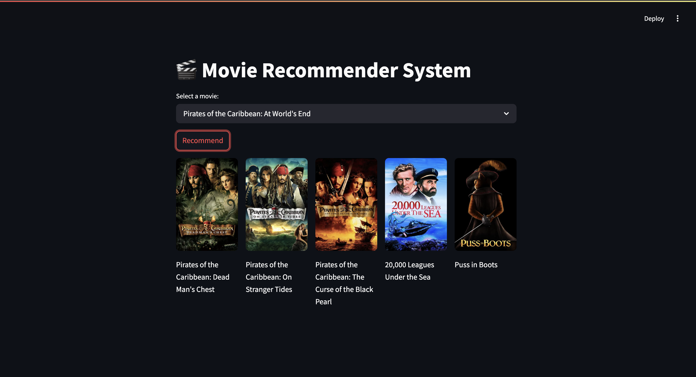

# 🎬 Movie Recommender System

[](https://github.com/anwar-opu/Movie_Recommender_App/stargazers)

A content-based movie recommender system that suggests similar movies using TMDB API for posters. Built with Python, Streamlit, and scikit-learn.

  <!-- Add a screenshot later -->

## Features ✨
- Recommends 5 similar movies based on user selection.
- Fetches high-quality posters from TMDB.
- Simple, intuitive UI powered by Streamlit.
- Fast recommendations using precomputed cosine similarity.

## Installation 🛠️

### Prerequisites
- Python 3.8+
- TMDB API key ([Get one here](https://www.themoviedb.org/settings/api))

### Steps
1. **Clone the repository:**
   ```bash
   git clone https://github.com/anwar-opu/Movie_Recommender_App.git
   cd Movie_Recommender_App
   ```
2. **Install dependencies:**
   ```bash
   pip install -r requirements.txt  # Install Streamlit, pandas, requests, etc.
   ```
3. **Add your TMDB API key:**
- Replace 06c0a930553b6496d17b10a9c882b9d0 in app.py with your actual API key.
4. **Run the app:**
  ```bash
  streamlit run app.py
  ```
